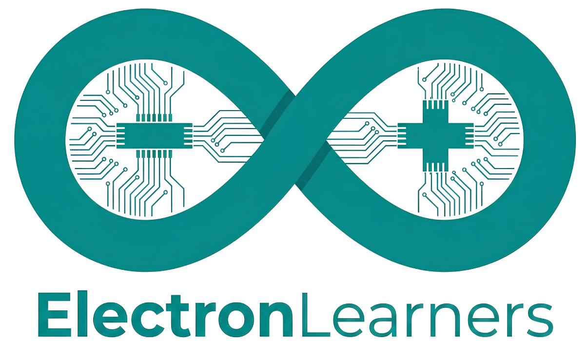

<div align="center">
  
  <h1>⚡ JR Learners Platform</h1>
  <p><strong>Learn. Build. Innovate.</strong></p>
  <p>Complete STEM Education & E-Commerce Platform with Physical Kits, Online Courses, YouTube Channel Integration (<a href="https://www.youtube.com/@LetsGetEngagedin">@LetsGetEngagedin</a>), Project Libraries, Institutional Portals, and Enterprise Admin Panel.</p>
</div>

---

## 🌟 Features Overview

- **20 Complete STEM Kits**: Detailed product catalog with datasheets, assembly guides, code downloads, component lists, and video tutorials.
- **YouTube Tutorial Hub**: Direct integration with YouTube channel [@LetsGetEngagedin](https://www.youtube.com/@LetsGetEngagedin) with video player modal, source code downloads (`.ino`, `.py`, `.c`), and transcript summaries.
- **15+ STEM Courses**: Electronics, Arduino, Embedded C, ESP32, STM32, PCB Design, IoT, Robotics, AI, Python, Machine Learning, Computer Vision, Raspberry Pi, Linux, Git.
- **100 STEM Projects Library**: Circuit schematics, hardware bill of materials, source code, and step-by-step assembly guides across 8 STEM disciplines.
- **100 Blog Articles**: SEO-optimized STEM tutorials, guides, and engineering articles.
- **Dynamic Certificate System**: Verification ID generation, downloadable canvas certificate, and public verification page (`/verify-certificate/[id]`).
- **Institutional Portals**: Dedicated **Student Dashboard**, **Teacher Portal**, and **School/Institution Management Portal**.
- **Enterprise Admin Panel**: Real-time analytics, inventory tracker, user role control, order fulfillment, coupon engine, system logs.
- **GitHub Pages Deployment**: 100% Client-side static export support (`output: 'export'`) with GitHub Actions workflow for zero-cost automated hosting.
- **Full FastAPI Backend**: Python FastAPI REST API backend with PostgreSQL database schema and Docker Compose orchestration.

---

## 📁 Repository Structure

```
JR Learners/
├── backend/                  # Python FastAPI Backend
│   ├── app/
│   │   ├── api/v1/          # REST API Routes (Auth, Products, Courses, YouTube, Orders, Admin)
│   │   ├── core/            # Security, JWT, Database Config
│   │   ├── models/          # SQLAlchemy Database Models
│   │   ├── schemas/         # Pydantic Request/Response Schemas
│   │   └── main.py          # FastAPI Main Entry Point & OpenAPI Docs
│   ├── schema.sql           # PostgreSQL DDL Schema Script
│   ├── seed.py              # Sample Database Seeder
│   └── requirements.txt     # Python Dependencies
├── frontend/                 # Next.js 15 + React + TypeScript + Tailwind CSS Frontend
│   ├── public/              # Static Assets & Icons
│   ├── src/
│   │   ├── components/      # UI, Header, Footer, Admin, Video Modal, Code Viewer
│   │   ├── context/         # Application State & LocalStorage Persistence
│   │   ├── data/            # Full Datasets (20 Kits, 100 Projects, 100 Blogs, Courses, Videos)
│   │   └── pages/           # All Pages & Routes (Home, Products, YouTube Hub, Admin, Portals)
│   ├── next.config.js       # Next.js Config with Static Export Support
│   ├── tailwind.config.js   # Tailwind Configuration with Modern STEM Theme Palette
│   └── package.json         # Frontend Dependencies
├── .github/
│   └── workflows/
│       └── deploy.yml       # GitHub Actions Static Export Deployment to GitHub Pages
├── docker-compose.yml       # Production Docker Stack (Nginx + Frontend + FastAPI + Postgres)
├── Dockerfile.frontend      # Docker build for Next.js
├── Dockerfile.backend       # Docker build for FastAPI
├── nginx.conf               # Reverse Proxy & SSL Nginx Config
└── README.md                # Platform Documentation
```

---

## 🎨 Color Palette & Design System

| Element | Color | Hex |
| :--- | :--- | :--- |
| **Primary** | Royal Blue | `#2563EB` |
| **Secondary** | Cyan | `#06B6D4` |
| **Accent** | Orange | `#F97316` |
| **Success** | Emerald | `#10B981` |
| **Background** | Light Gray | `#F8FAFC` |
| **Dark Surface** | Slate | `#0F172A` |

---

## 🚀 Quick Start (Frontend & Static / GitHub Pages Mode)

```bash
# Navigate to frontend directory
cd frontend

# Install dependencies
npm install

# Run local development server
npm run dev

# Open browser at http://localhost:3000
```

### Export for GitHub Pages Static Hosting
```bash
# Build static site to /out directory
npm run build

# The output folder `out` can be pushed to gh-pages branch or served statically
```

---

## 🐍 Quick Start (FastAPI Backend Server)

```bash
# Navigate to backend directory
cd backend

# Create virtual environment
python -m venv venv
source venv/bin/activate  # On Windows: venv\Scripts\activate

# Install requirements
pip install -r requirements.txt

# Run FastAPI Dev Server with Swagger UI
uvicorn app.main:app --reload --port 8000

# Swagger Documentation: http://localhost:8000/docs
```

---

## 🐳 Docker Deployment

```bash
# Launch entire stack (PostgreSQL + FastAPI + Next.js + Nginx)
docker-compose up --build -d
```

---

## 📜 License
Licensed under the MIT License. Developed for **JR Learners** — *Learn. Build. Innovate.*

